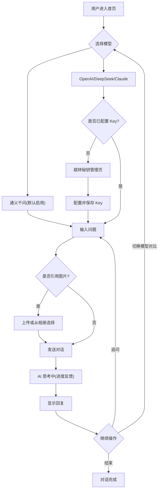

## 1. 产品概述
控制台是一款面向开发者与 AI 爱好者的多模型 AI 调用工具,提供统一的对话入口,支持通义千问、OpenAI、DeepSeek、Claude 等模型切换对比,并集成阿里云视频点播相册,实现图片素材与 AI 的联动调用。
- 目标用户:开发者、AI 爱好者、需要多模型对比测试的技术人员
- 核心价值:统一入口管理多模型 + 相册与 AI 联动,打造高效、清晰、可控的专业工具体验

## 2. 核心功能

### 2.1 用户角色
| 角色 | 注册方式 | 核心权限 |
|------|---------------------|------------------|
| 普通用户 | 无需注册(前台配置 Key 或使用管理员 Key) | 对话、相册浏览、秘钥管理、图片引用 |
| 管理员(后台) | 后台登录 | 查看访问记录、标记异常 IP/用户、管理通义千问默认 Key |

### 2.2 功能模块
1. **首页 / AI 对话页**:模型选择、多轮对话、图片上传、引用相册图片、对话历史
2. **秘钥管理页**:各模型 API Key 卡片式配置、加密存储选项、通义千问默认启用
3. **相册页**:阿里云点播内容网格展示、分类筛选、预览播放
4. **相册分类页**:分类创建、内容分配、筛选浏览
5. **帮助中心页**:使用说明、模型选择指引、常见问题

### 2.3 页面详情
| 页面名称 | 模块名称 | 功能描述 |
|-----------|-------------|---------------------|
| 首页 / AI 对话页 | 模型选择器 | 顶部下拉切换通义千问/OpenAI/DeepSeek/Claude,选中态高亮 |
| 首页 / AI 对话页 | 对话历史区 | 气泡式对话流,用户气泡科技蓝、AI 气泡深灰蓝,打字机效果 |
| 首页 / AI 对话页 | 输入区 | 输入框 + 发送按钮 + 图片上传按钮(支持从相册选择),Enter 发送 |
| 首页 / AI 对话页 | 侧边栏 | 对话历史列表、快捷入口(相册、秘钥管理) |
| 秘钥管理页 | 模型卡片列表 | 每模型一张卡片:名称、状态指示器、Key 输入框、保存按钮 |
| 秘钥管理页 | 通义千问卡片 | 默认显示"已启用(无需配置)";管理员模式下可配置并查看访问记录 |
| 相册页 | 分类筛选器 | 顶部按分类筛选 |
| 相册页 | 媒体网格 | 网格化缩略图,点击弹出预览模态框(图片放大/视频播放) |
| 相册页 | 状态层 | 加载中 / 内容展示 / 空状态 |
| 相册分类页 | 分类管理 | 创建分类、分配内容、按分类筛选 |
| 帮助中心页 | 使用说明 | 模型选择指引、API Key 配置说明、图片引用操作指引 |
| 帮助中心页 | 常见问题 | FAQ 折叠列表 |

## 3. 核心流程

**用户对话流程**:用户进入首页 → 选择模型 → 输入问题(可选上传图片或从相册引用) → 发送 → AI 思考中(进度反馈) → 回复显示 → 继续追问或切换模型对比。

**秘钥配置流程**:进入秘钥管理 → 选择模型卡片 → 输入 API Key → 选择加密存储或不存储 → 保存 → 返回对话页选择该模型使用。

**相册引用流程**:在对话输入区 → 点击图片上传 → 选择"从相册选择" → 选中图片 → 发送给 AI 分析。

## 4. 用户界面设计

### 4.1 设计风格
- 主色:深蓝 #1E3A5F(导航、侧边栏、主按钮)
- 辅色:灰蓝 #4A6FA5(次要按钮、卡片边框、分隔线)
- 强调色:科技蓝 #0066FF(发送按钮、链接、选中态)
- 功能色:成功 #10B981、错误 #EF4444、警告 #F59E0B
- 背景:主背景 #0F172A、卡片 #1E293B、用户气泡 #0066FF、AI 气泡 #1E293B
- 按钮风格:圆角(8-12px)、Glassmorphism 卡片半透明 + 模糊背景、hover 位移 2px + 阴影加深
- 字体:无衬线字体,大标题 24-32px/600,正文 14-16px/400,小字 12-13px/400
- 布局:居中聚焦式对话区 + 侧边栏导航
- 图标:lucide-react 图标库
- 动效:消息气泡滑入(200ms ease-out)、AI 打字机效果、模型切换平滑展开、列表项交错进入(50ms 间隔)

### 4.2 页面设计概览
| 页面名称 | 模块名称 | UI 元素 |
|-----------|-------------|-------------|
| 首页 / AI 对话页 | Hero 对话区 | 深色渐变背景、顶部模型选择下拉、中部气泡对话流、底部输入框 + 发送 + 图片上传 |
| 首页 / AI 对话页 | 侧边栏 | 对话历史列表、相册/秘钥管理快捷入口,桌面端固定 |
| 秘钥管理页 | 模型卡片网格 | 卡片式布局,Glassmorphism 风格,状态指示灯,Key 输入框带显隐切换 |
| 相册页 | 顶部筛选 | 分类标签横向滚动 |
| 相册页 | 媒体网格 | 4-6 列响应式网格,缩略图 hover 放大,视频带播放图标 |
| 相册页 | 预览模态框 | 居中弹出,支持图片放大 / 视频播放,点击遮罩关闭 |
| 相册分类页 | 分类列表 | 左侧分类树 + 右侧内容区 |
| 帮助中心页 | FAQ | 折叠式问答列表,分类标签筛选 |

### 4.3 响应式
- 桌面优先设计,移动端自适应
- 断点:移动端 <768px(底部导航、单列相册、置顶输入框);平板 768-1023px(可折叠侧边栏);桌面 ≥1024px(完整侧边栏 + 4-6 列相册)
- 触控优化:移动端大按钮、大发送区,Enter 发送(桌面)与发送按钮并存

### 4.4 状态反馈
- 处理中:进度条 + "AI 思考中…"文字
- 成功:绿色提示 + 结果显示
- 失败:红色提示 + 错误原因 + 重试按钮
- 短时加载:loading 图标;长时生成:进度条 + 动态提示语

## 5. 补充说明
- 通义千问默认启用,通过服务端代理调用;使用管理员 Key 时对提问限速(5 秒冷却),快速访问 IP/用户名在后台标红记录
- OpenAI/DeepSeek/Claude 需用户在秘钥管理页配置 Key,前端不暴露 Key,全部经服务端代理转发
- 阿里云视频点播相册支持图片预览与视频播放,分类信息存数据库
- 文案遵守广告法合规,避免极限用语,改用"多模型支持""专业工具""高效调用"等表述
