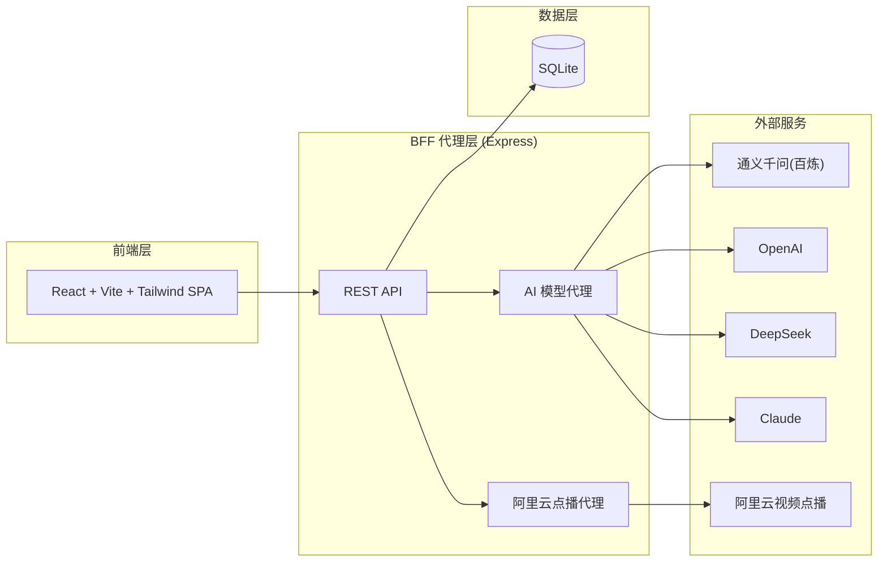
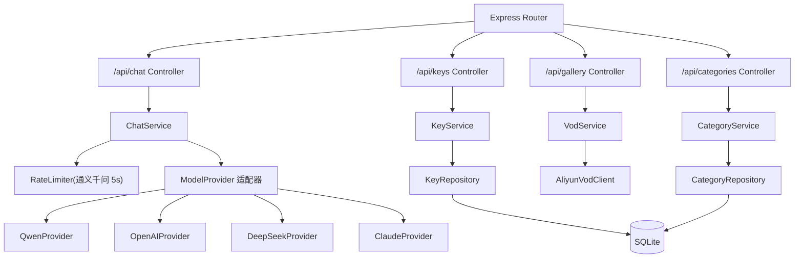
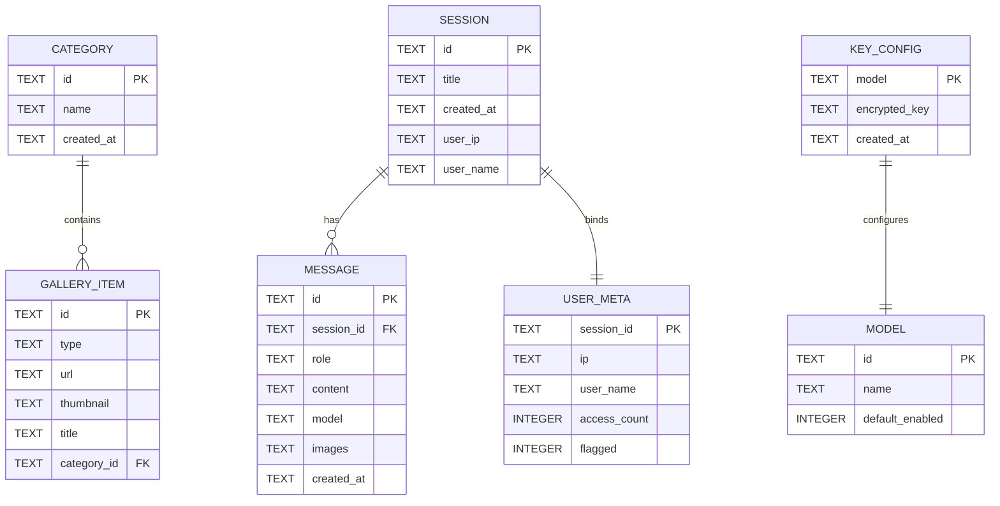

## 1. 架构设计

控制台采用前后端分离架构:前端 React + Vite + Tailwind 构建单页应用,Express 服务端作为 BFF 代理层,统一转发 AI 模型调用与阿里云点播请求,前端不暴露任何 API Key。数据层使用 SQLite(轻量、零配置,适合工具型站点)存储相册分类与对话历史。



## 2. 技术说明
- 前端:React@18 + react-router-dom + tailwindcss@3 + Vite + zustand(状态管理)
- 初始化工具:vite-init(react-express-ts 模板)
- 后端:Express@4 + TypeScript(ESM),作为 BFF 代理
- 数据库:SQLite(better-sqlite3),MVP 阶段轻量存储相册分类、对话历史、访问记录
- 图标:lucide-react
- 动效:CSS transitions + framer-motion(气泡滑入、列表交错)
- AI 调用:统一通过服务端 `/api/chat` 代理,流式返回(SSE)

## 3. 路由定义
| 路由 | 用途 |
|-------|---------|
| `/` | 首页 / AI 对话页(核心对话区) |
| `/settings` | 秘钥管理页(配置各模型 API Key) |
| `/gallery` | 相册页(展示阿里云点播内容) |
| `/gallery/categories` | 相册分类页(管理分类) |
| `/help` | 帮助中心页(使用说明、FAQ) |

## 4. API 定义

### 4.1 对话接口
```typescript
// POST /api/chat - 统一对话代理(流式 SSE)
interface ChatRequest {
  model: 'qwen' | 'openai' | 'deepseek' | 'claude';
  messages: Array<{ role: 'user' | 'assistant'; content: string; images?: string[] }>;
  sessionId?: string;
}
// 响应:text/event-stream,逐字推送
// event: token  data: { "content": "..." }
// event: done   data: { "sessionId": "..." }
// event: error  data: { "message": "..." }
```

### 4.2 秘钥管理接口
```typescript
// GET /api/keys - 获取已配置状态(不返回明文)
interface KeyStatusResponse {
  models: Array<{
    model: string;
    configured: boolean;       // 是否已配置
    defaultEnabled?: boolean;  // 通义千问默认启用
  }>;
}
// POST /api/keys - 保存某模型 Key(加密后存 DB 或仅会话内存)
interface SaveKeyRequest {
  model: string;
  apiKey: string;
  persist: boolean; // true=加密存储,false=不存储仅当前会话
}
```

### 4.3 相册接口
```typescript
// GET /api/gallery?category=&type=image|video
interface GalleryItem {
  id: string;
  type: 'image' | 'video';
  url: string;       // 点播播放地址 / 图片 URL
  thumbnail: string;
  title: string;
  categoryId?: string;
}
// GET /api/gallery/:id - 单项详情(供 AI 引用取图)
```

### 4.4 分类接口
```typescript
// GET /api/categories
interface Category { id: string; name: string; count: number; }
// POST /api/categories { name: string }
// PUT /api/categories/:id { name?: string }
// DELETE /api/categories/:id
// POST /api/gallery/:id/category { categoryId: string }
```

### 4.5 通义千问限流接口
```typescript
// POST /api/chat 时,若使用管理员 Key:
// - 同 IP/用户 5 秒冷却,超限返回 429
// - 后台记录 IP + 用户名 + 时间戳,高频访问在管理后台标红
```

## 5. 服务端架构图


## 6. 数据模型

### 6.1 数据模型定义


### 6.2 数据定义语言
```sql
-- 相册分类表
CREATE TABLE IF NOT EXISTS category (
  id TEXT PRIMARY KEY,
  name TEXT NOT NULL,
  created_at TEXT DEFAULT CURRENT_TIMESTAMP
);

-- 相册内容表(从阿里云点播同步元数据)
CREATE TABLE IF NOT EXISTS gallery_item (
  id TEXT PRIMARY KEY,
  type TEXT NOT NULL CHECK(type IN ('image','video')),
  url TEXT NOT NULL,
  thumbnail TEXT NOT NULL,
  title TEXT,
  category_id TEXT,
  FOREIGN KEY (category_id) REFERENCES category(id) ON DELETE SET NULL
);
CREATE INDEX IF NOT EXISTS idx_gallery_category ON gallery_item(category_id);

-- 对话会话表
CREATE TABLE IF NOT EXISTS session (
  id TEXT PRIMARY KEY,
  title TEXT,
  created_at TEXT DEFAULT CURRENT_TIMESTAMP,
  user_ip TEXT,
  user_name TEXT
);

-- 对话消息表
CREATE TABLE IF NOT EXISTS message (
  id TEXT PRIMARY KEY,
  session_id TEXT NOT NULL,
  role TEXT NOT NULL CHECK(role IN ('user','assistant')),
  content TEXT NOT NULL,
  model TEXT,
  images TEXT, -- JSON array of URLs
  created_at TEXT DEFAULT CURRENT_TIMESTAMP,
  FOREIGN KEY (session_id) REFERENCES session(id) ON DELETE CASCADE
);
CREATE INDEX IF NOT EXISTS idx_message_session ON message(session_id);

-- API Key 配置表(加密存储)
CREATE TABLE IF NOT EXISTS key_config (
  model TEXT PRIMARY KEY,
  encrypted_key TEXT NOT NULL,
  created_at TEXT DEFAULT CURRENT_TIMESTAMP
);

-- 用户访问记录表(通义千问限流 / 后台标红)
CREATE TABLE IF NOT EXISTS user_meta (
  session_id TEXT PRIMARY KEY,
  ip TEXT,
  user_name TEXT,
  access_count INTEGER DEFAULT 0,
  flagged INTEGER DEFAULT 0,
  last_request_at TEXT,
  FOREIGN KEY (session_id) REFERENCES session(id) ON DELETE CASCADE
);

-- 初始数据:模型列表
INSERT OR IGNORE INTO category (id, name) VALUES ('default', '默认分类');
```

## 7. 安全与代理说明
- 前端永不持有明文 API Key:用户选择"加密存储"时,Key 经服务端 AES 加密写入 `key_config`;选择"不存储"时仅存于服务端会话内存,刷新后失效
- 所有 AI 调用走 `/api/chat`,由服务端拼接对应 Provider 的 Key 转发,响应以 SSE 流式回传
- 通义千问使用管理员 Key 时启用 5 秒冷却限流,高频访问 IP/用户名写入 `user_meta.flagged=1` 供后台标红
- 阿里云点播 AccessKey 仅存于服务端环境变量,前端通过 `/api/gallery` 获取已签名的播放/预览地址
- 文案遵守广告法,禁用"最智能/第一/领先"等极限用语
